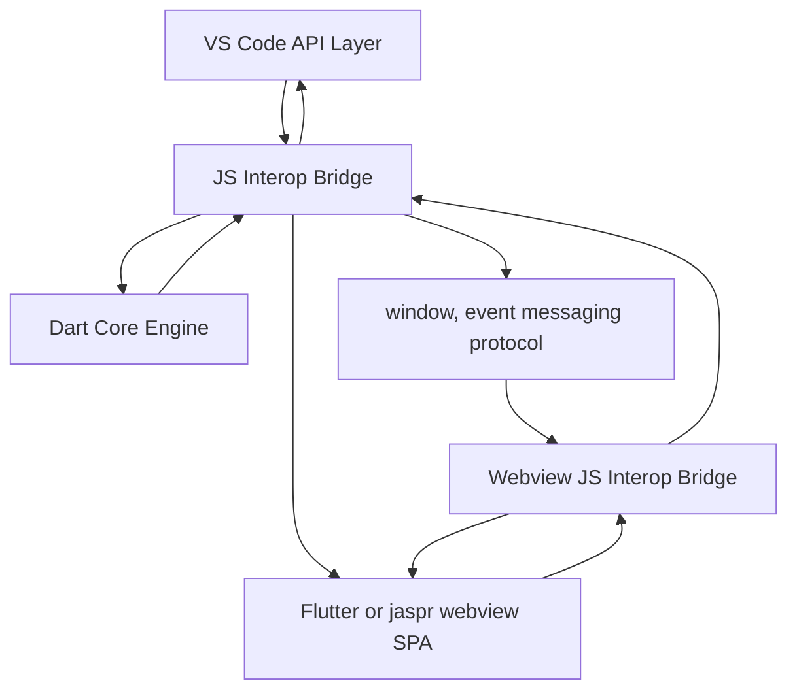

````markdown
That's an interesting architecture, aiming for a completely Dart-driven VS Code extension! Let's break down your proposed design and evaluate its potential.

You're suggesting a layered architecture like this:


````

**Key Components and Flow:**

- **[A] VS Code API Layer (JavaScript):** This is the native VS Code Extension API, which is inherently JavaScript-based. Your Dart code will interact with VS Code _only_ through this layer.
- **[C] JS Interop Bridge (Dart - Extension Side):** This is the crucial Dart layer using `dart:js_interop`. It acts as a bridge, translating calls from your Dart Core Engine into JavaScript calls that the VS Code API Layer understands, and vice versa.
- **[D] Dart Core Engine (Dart):** This is the heart of your extension – all your core logic, algorithms, data processing, and AI-related functionalities are implemented purely in Dart.
- **[W] Window/Event Messaging Protocol:** This represents the communication channel between your Dart Core Engine (running in the extension's main process) and the WebView UI. You'd likely use `postMessage` and event listeners for this, a standard approach for WebView communication in VS Code extensions.
- **[F] Flutter/Jaspr WebView SPA (Dart - WebView Side):** Your User Interface is built as a Single Page Application within a WebView, using either Flutter for Web or Jaspr (a Dart web framework). This UI is also written entirely in Dart (or compiled from Dart).
- **[WC] Webview JS Interop Bridge (JavaScript - WebView Side):** Since WebViews in VS Code run in a JavaScript environment, you'll need a _JavaScript_ bridge within the WebView to facilitate communication with the Dart Core Engine via the `window/event messaging protocol`. This bridge would receive messages from the WebView (Flutter/Jaspr UI) and forward them to the Dart JS Interop Bridge in the main extension process, and vice versa.

**Analysis of the Architecture:**

**Pros:**

- **Pure Dart Development (Mostly):** You achieve your goal of writing almost exclusively in Dart. The core logic, UI (if using Flutter/Jaspr for WebView), and even the interop layers are Dart-centric. You minimize direct TypeScript/JavaScript code to the absolute necessary bridge points.
- **Clear Separation of Concerns:** The architecture enforces a clear separation:
  - **Dart Core:** Encapsulates the main logic, making it potentially more portable and testable in isolation (as you intended).
  - **JS Interop Bridges:** Isolate the platform-specific (VS Code API) interactions into dedicated bridge layers.
  - **WebView UI:** Keeps the UI logic separate from the core engine.
- **Leverages Dart Strengths:** You can fully utilize Dart's language features, tooling, and potentially Flutter's UI capabilities (if you choose Flutter for the WebView).
- **Testability (Potentially Enhanced):** With well-defined JS Interop Bridges, you could potentially mock these bridges in your Dart tests, allowing you to unit test the Dart Core Engine in isolation without needing a full VS Code environment.

**Cons and Challenges:**

- **Increased Complexity (Interop Overhead):** You introduce _two_ JS Interop Bridges: one in the main extension process and another in the WebView. Managing communication and data serialization across these bridges, as well as the window messaging protocol, adds significant complexity.
- **Performance Overhead:** Each interop layer and message passing step introduces potential performance overhead. Frequent communication between the UI and the core engine, especially if data-intensive, could become less efficient than a more direct approach.
- **Debugging Complexity (Multi-Layered):** Debugging issues can become more challenging as you have to trace problems across multiple layers: Flutter/Jaspr UI -> WebView JS Bridge -> Window Messaging -> Dart JS Interop Bridge -> Dart Core Engine -> Dart JS Interop Bridge -> VS Code API. Pinpointing the source of errors might require more effort.
- **Still Requires JavaScript/VS Code API Knowledge:** Even though you're writing Dart, you _must_ have a deep understanding of the VS Code JavaScript API to build the Dart JS Interop Bridge effectively. You're not escaping the need to know the VS Code API; you're just interacting with it indirectly through Dart.
- **WebView Communication Limitations:** `postMessage` based communication between the extension and WebView can have limitations in terms of data transfer rates and complexity for very frequent or real-time updates.
- **Larger Extension Size (Potentially):** If you use Flutter for the WebView, the extension bundle size will likely be larger compared to a simpler WebView UI or native VS Code UI elements.
- **Less Conventional, Smaller Community Support:** This architecture is less common for VS Code extensions. You might find fewer examples, libraries, and community support specifically tailored to this Dart-centric approach compared to standard TypeScript-based extensions.

**Regarding the `officejs_dart` Example:**

The [`officejs_dart`](https://github.com/xsoulspace/officejs_dart/tree/master/lib) project you linked demonstrates Dart's `js_interop` capabilities for interacting with browser-based JavaScript APIs (specifically, Office.js in that case). It shows how to define Dart interfaces that mirror JavaScript APIs and how to call JavaScript functions from Dart. This project is a good example of the _Dart JS Interop Bridge_ ([C] in your diagram) concept in action.

**Evaluation and Recommendation:**

This architecture is **technically feasible** and cleverly addresses your desire to minimize TypeScript/JavaScript and maximize Dart usage. It offers potential benefits in terms of code organization, testability, and leveraging Dart's strengths.

**However, it introduces significant complexity due to the dual JS Interop Bridges and the multi-layered communication.** This complexity might outweigh the benefits, especially for an initial VS Code extension project. Debugging, performance, and development effort could become more challenging.

**Recommendation:**

1.  **Start with a Simpler Architecture First:** Before committing to this fully Dart-centric approach, consider starting with a slightly simpler architecture, perhaps:

    - **TypeScript for Extension Core Logic:** Use TypeScript for the main extension logic that directly interacts with the VS Code API.
    - **Flutter/Dart for WebView UI (with JS Interop):** If you need a rich WebView UI, use Flutter for Web (or Jaspr) and `dart:js_interop` within the WebView to communicate with the TypeScript backend. This simplifies the architecture by having only _one_ JS Interop Bridge (in the WebView).

2.  **Iterate to the Dart-Centric Architecture if Justified:** If you find that the simpler architecture becomes limiting, or if the benefits of a fully Dart-centric approach (like enhanced testability or specific Dart language advantages for your core logic) become crucial, then you can _iteratively_ move towards the more complex architecture you've proposed.

3.  **Prototype and Benchmark:** Before fully committing, create a small prototype of your Dart-centric architecture, especially focusing on the JS Interop Bridges and WebView communication. Benchmark performance and experiment with debugging workflows to assess the practical implications of the added complexity.

4.  **Consider Jaspr as a Lighter WebView Option:** If bundle size and performance are concerns for the WebView UI, explore Jaspr as a potentially lighter-weight Dart web framework compared to Flutter for Web.

**In summary, your proposed architecture is innovative and technically sound, but it's a more advanced and complex approach. For initial development, a slightly more conventional architecture with TypeScript for the core and Flutter/Dart (if needed) for the WebView might be more pragmatic. You can then evolve towards the fully Dart-centric design if the benefits justify the added complexity based on your project's specific needs and constraints.**
